# GA-Tuned Adaptive Fuzzy FOC Dashboard for EV Motor Control

[](https://www.python.org/downloads/)
[](https://marimo.io/)
[](https://opensource.org/licenses/MIT)

An interactive Marimo dashboard for the simulation and optimization of an advanced **Field-Oriented Control (FOC)** system for a Permanent Magnet Synchronous Motor (PMSM) in Electric Vehicles. The outer speed loop is managed by a **Genetic Algorithm-Tuned Adaptive Fuzzy Fractional Order PID (GA-AFFFOPID)** controller.

This project is a practical, hands-on implementation and visualization of the concepts presented in the following research paper, which serves as the primary inspiration and theoretical foundation for this work:

> **Sime, T.L., Aluvada, P., Habtamu, S. et al. "Modeling of genetic algorithm tuned adaptive fuzzy fractional order PID speed control of permanent magnet synchronous motor for electric vehicle." *Discover Applied Sciences* 6, 505 (2024).**
> 
> **DOI:** [https://doi.org/10.1007/s42452-024-06183-8](https://doi.org/10.1007/s42452-024-06183-8)

---

## 📸 Dashboard Demo

*(This is an ideal place to add a GIF or a high-quality screenshot of your dashboard)*


## 🚀 Core Features

*   **Complete FOC Simulation:** Models the entire Field-Oriented Control loop, including a detailed outer speed loop and a simplified inner current loop.
*   **Intelligent Speed Controller:** Implements the paper's advanced **Switched GA-AFFFOPID** controller, which uses:
    - **Adaptive Fuzzy Logic** during transient states for fast response.
    - A simple **FOPID** during steady-state for stability and efficiency.
*   **Controller Comparison:** Easily switch between conventional PID, standard FOPID, and the advanced GA-AFFFOPID to compare performance.
*   **Genetic Algorithm Console:** A dedicated interface to configure, run, and analyze the GA optimization process for the controller's key parameters.
*   **Deep Dive Visualizations:** In-depth, interactive plots for Fuzzy Logic internals (Control Surfaces, Rule Matrices) and Fractional Calculus validation (Bode Plots).
*   **Advanced Performance Metrics:** Analyzes not just tracking error, but also crucial real-world factors like **Energy Consumption**, **Control Effort**, and **Ride Comfort**.

## 🏗️ Controller Architecture

The diagram below illustrates the complete Field-Oriented Control (FOC) architecture implemented in this simulation.

```mermaid
graph TD
    subgraph "Outer Speed Loop (Intelligent Controller)"
        RefSpeed["ω* (Ref Speed)"]
        ActualSpeed["ω (Actual Speed)"]
        SpeedErrorSub["(+) Sum"]
        
        GA_AFFFOPID["🧠 GA-Tuned<br>Adaptive Fuzzy<br>Fractional PID"]
        
        RefSpeed -- + --> SpeedErrorSub
        ActualSpeed -- - --> SpeedErrorSub
        SpeedErrorSub -- "Speed Error (e)" --> GA_AFFFOPID
    end

    subgraph "Inner Current & Motor System (Simplified Plant)"
        direction LR
        Iq_ref["Iq* (Torque Ref)"]
        GA_AFFFOPID --> Iq_ref
        
        Plant["PMSM Motor,<br>Inverter & EV Dynamics<br>(Simplified Model)"]
        Iq_ref -- "Control Signal" --> Plant
        
        Plant -- "Measured Speed (ω)" --> ActualSpeed
    end
```



## 🏁 Getting Started

This project is designed to be run in a containerized environment for a seamless and reproducible setup.

### Prerequisites

*   [Docker Desktop](https://www.docker.com/products/docker-desktop/)
*   [Visual Studio Code](https://code.visualstudio.com/)
*   [VS Code Dev Containers Extension](https://marketplace.visualstudio.com/items?itemName=ms-vscode-remote.remote-containers)

### Installation & Running

1.  **Clone the repository:**
    ```bash
    git clone https://github.com/taha2samy/Implementation-of-Sime-et-al-2024-PMSM-Control
    cd Implementation-of-Sime-et-al-2024-PMSM-Control

    ```
2.  **Open in VS Code:** Open the cloned project folder.
3.  **Reopen in Container:** A notification will appear in the bottom-right corner. Click on **"Reopen in Container"**.
4.  **Wait:** VS Code will build the Docker container and install all dependencies automatically. This might take a few minutes on the first run.
5.  **Run the App:** Once the environment is ready, open a new terminal in VS Code (`Ctrl` + ` ` `) and execute the following command:
    ```bash
    # To run in interactive edit mode
    marimo edit pmsm_project.py
    ```
    Marimo will provide a URL in the terminal. **Ctrl+Click** the link to open the dashboard in your browser.

## 🙏 Acknowledgement

This project is an educational implementation created to visualize and explore the advanced control strategies presented in the referenced research paper. All credit for the novel controller architecture, theoretical framework, and original research belongs to the authors: **Tolcha Lemma Sime, Prashant Aluvada, Solomon Habtamu, and Zewde Tolosa**.

## 📄 License

This project is licensed under the MIT License.
