# Marimo Dashboard for a GA-Tuned Adaptive Fuzzy Fractional Order PID Controller

[](https://www.python.org/downloads/)
[](https://opensource.org/licenses/MIT)

An interactive Marimo dashboard for the simulation and optimization of an **Adaptive Fuzzy Fractional Order PID (AFFFOPID)** controller for Permanent Magnet Synchronous Motors (PMSM) in Electric Vehicles.

This project is a practical implementation and visualization of the concepts presented in the following research paper, which serves as the primary inspiration and theoretical foundation for this work:

> **Sime, T.L., Aluvada, P., Habtamu, S. et al. "Modeling of genetic algorithm tuned adaptive fuzzy fractional order PID speed control of permanent magnet synchronous motor for electric vehicle." *Discover Applied Sciences* 6, 505 (2024).**
> 
image.png

---

## 📸 Dashboard Demo


## 🚀 Core Features

*   **Interactive Simulation:** A real-time dashboard to visualize motor speed, torque, and current responses under various load conditions.
*   **Controller Comparison:** Easily switch between conventional PID, Fractional Order PID (FOPID), and the advanced GA-AFFFOPID controllers.
*   **Genetic Algorithm Console:** A dedicated interface to configure, run, and analyze the GA optimization process, with advanced visualizations like parallel coordinates plots.
*   **Deep Dive Modules:** Separate columns for in-depth exploration of the Fuzzy Logic internals (Membership Functions, Control Surface) and Fractional Calculus behavior (Bode Plots).
*   **Advanced Performance Metrics:** Go beyond tracking error to analyze crucial real-world factors like **Energy Consumption**, **Control Effort**, and **Ride Comfort (Jerk)**.
*   **Reproducible Environment:** A fully configured **Dev Container** is included for a one-click, consistent, and isolated development environment.

## 🏗️ Controller Architecture Diagram

The diagram below illustrates the architecture of the proposed GA-AFFFOPID controller. The system features two layers of intelligence:
1.  **Genetic Algorithm (Offline/Background):** Optimizes the *base parameters* of the FOPID controller (`Kp`, `Ki`, `Kd`, `λ`, `μ`).
2.  **Fuzzy Logic Controller (Online/Real-time):** Takes the real-time `error` and `change in error` to produce an adaptive gain multiplier (`α`) that scales the FOPID gains, allowing the controller to react instantly to disturbances.

```mermaid
graph TD
    subgraph "System Inputs & Feedback"
        RefSpeed["ω* (Reference Speed)"]
        ActualSpeed["ω (Actual Speed)"]
    end

    subgraph "Adaptive Fuzzy FOPID Controller"
        direction LR
        ErrorSub["(+) Sum"]
        
        subgraph "🧠 Fuzzy Logic (Real-time Adaptation)"
            FuzzyInput(["Error (e)<br>Change in Error (de/dt)"])
            FLC["Fuzzy Logic<br>Controller"]
            GainAlpha["Adaptive Gain (α)"]
            FuzzyInput --> FLC --> GainAlpha
        end

        subgraph "⚙️ Fractional Order PID (FOPID)"
            P["Kp"]
            I["Ki / s^λ"]
            D["Kd * s^μ"]
        end
        
        PIDSum["(+) Sum"]

        GainAlpha -- Scales Gains --> P
        GainAlpha -- Scales Gains --> I
        GainAlpha -- Scales Gains --> D
        
        P -- Proportional Term --> PIDSum
        I -- Integral Term --> PIDSum
        D -- Derivative Term --> PIDSum
    end

    subgraph "🧬 Genetic Algorithm (Offline Optimization)"
        GA["Genetic Algorithm<br>Optimizer"]
        Fitness["ISE Cost Function<br>∫e² dt"]
        GA -- Finds Best --> BaseParams["Base Parameters<br>Kp, Ki, Kd, λ, μ"]
        BaseParams -- Sets Initial Values --> P
        BaseParams -- Sets Initial Values --> I
        BaseParams -- Sets Initial Values --> D
        ErrorSub -- "Performance<br>for Fitness" --> Fitness --> GA
    end

    subgraph "Physical System (Plant)"
        Plant["PMSM Motor &<br>EV Dynamics"]
    end
    
    RefSpeed -- + --> ErrorSub
    ActualSpeed -- - --> ErrorSub
    ErrorSub -- "Speed Error (e)" --> FuzzyInput
    ErrorSub -- "Speed Error (e)" --> I
    ErrorSub -- "Speed Error (e)" --> P
    ErrorSub -- "Speed Error (e)" --> D
    
    PIDSum -- "Control Signal (Iq_ref)" --> Plant
    Plant -- "Measured Speed" --> ActualSpeed
```




## 🏁 Getting Started

This project is designed to be run within a Dev Container for a seamless and reproducible setup.

### Prerequisites

*   [Docker Desktop](https://www.docker.com/products/docker-desktop/)
*   [Visual Studio Code](https://code.visualstudio.com/)
*   [VS Code Dev Containers Extension](https://marketplace.visualstudio.com/items?itemName=ms-vscode-remote.remote-containers)

### Installation & Running

1.  **Clone the repository:**
    ```bash
    git clone https://github.com/YOUR_USERNAME/YOUR_REPOSITORY_NAME.git
    cd YOUR_REPOSITORY_NAME
    ```
2.  **Open in VS Code:** Open the cloned project folder.
3.  **Reopen in Container:** A notification will appear in the bottom-right corner. Click on **"Reopen in Container"**.
4.  **Wait:** VS Code will build the Docker container and install all dependencies automatically. This might take a few minutes on the first run.
5.  **Run the App:** Once the environment is ready, open a new terminal in VS Code (`Ctrl` + ` ` `) and execute the following command:
    ```bash
    # To run in interactive edit mode
    marimo edit pmsm_project.py
    ```
    Marimo will provide a URL in the terminal. Ctrl+Click the link to open the dashboard in your browser.

## 🙏 Acknowledgement

This project is an educational implementation created to visualize and explore the advanced control strategies presented in the referenced paper. All credit for the novel controller architecture, theoretical framework, and original research belongs to the authors: **Tolcha Lemma Sime, Prashant Aluvada, Solomon Habtamu, and Zewde Tolosa**.

## 📄 License

This project is licensed under the MIT License. See the `LICENSE` file for more details.
